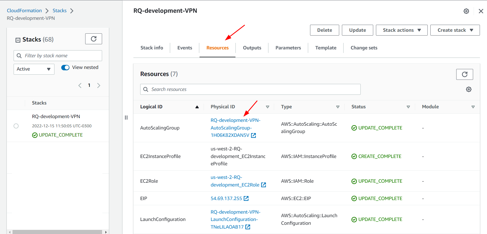
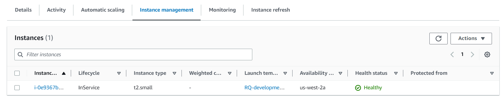
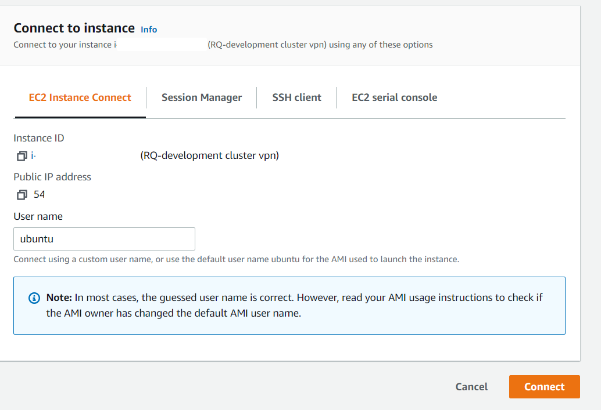
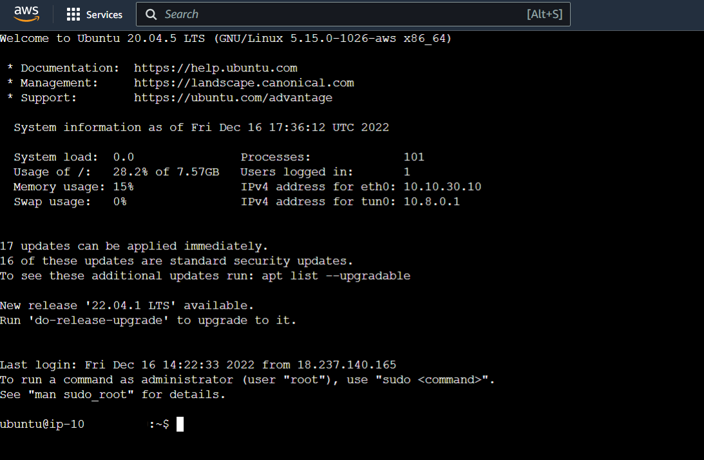
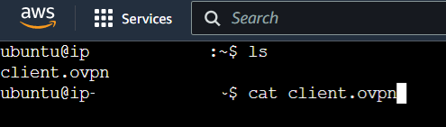
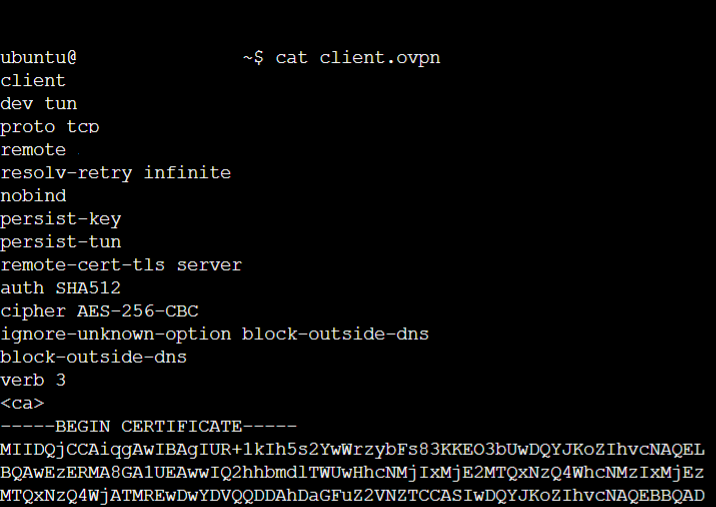
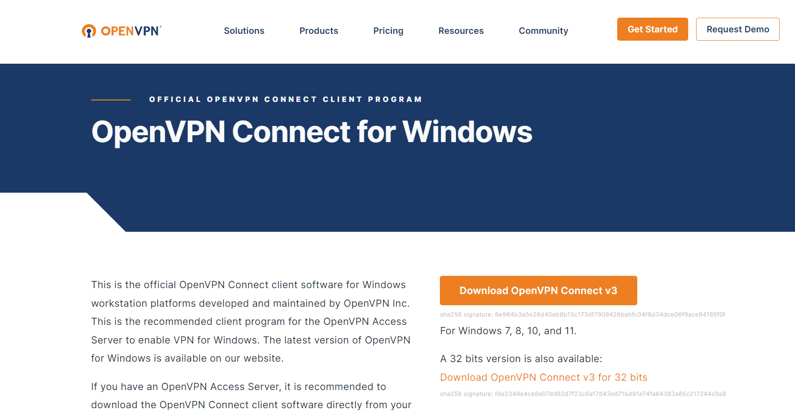
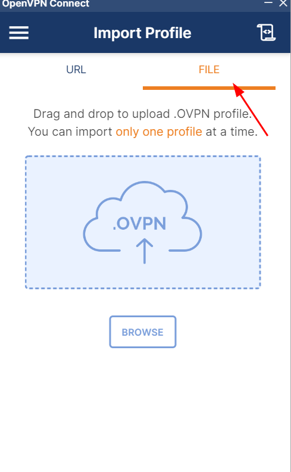
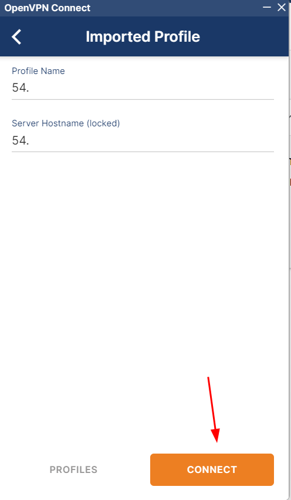
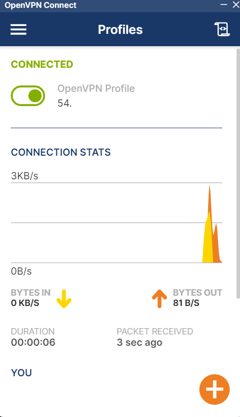

# How to use
### ⚠️ This script work with Ubuntu 20.04.0 ami ⚠️

- Upload vpn template to cloudformation
- Click on the "resources" tab, on the cloudformation stacks page, then on the AutoScalingGroup link

- Then click on "instance management", choose the VPN instance and click on it

- Then click on the connect button and choose the best option to connect to the instance. In this example, we will connect to EC2 directly through the AWS platform. Then click in connect orange button

- A terminal will open inside the instance on another screen, similar to the picture below:

- We need to get the vpn client file generated, then run the "ls" command

- With the client.ovpn file generated, we need to copy its content to a file on our local machine, for that we will issue the command "cat client.ovpn". And this is the result:

- The content must be copied to an external file with the ".ovpn" extension. After that, we need to test the connection to the VPN, for that we will use the "OpenVPN Connect" program. Tool download link [here( for windows)](https://openvpn.net/client-connect-vpn-for-windows/)

- After installing the tool, open the program and click on the file tab. Then import the file with the client content and click on connect, like the images below:

- VPN connected

